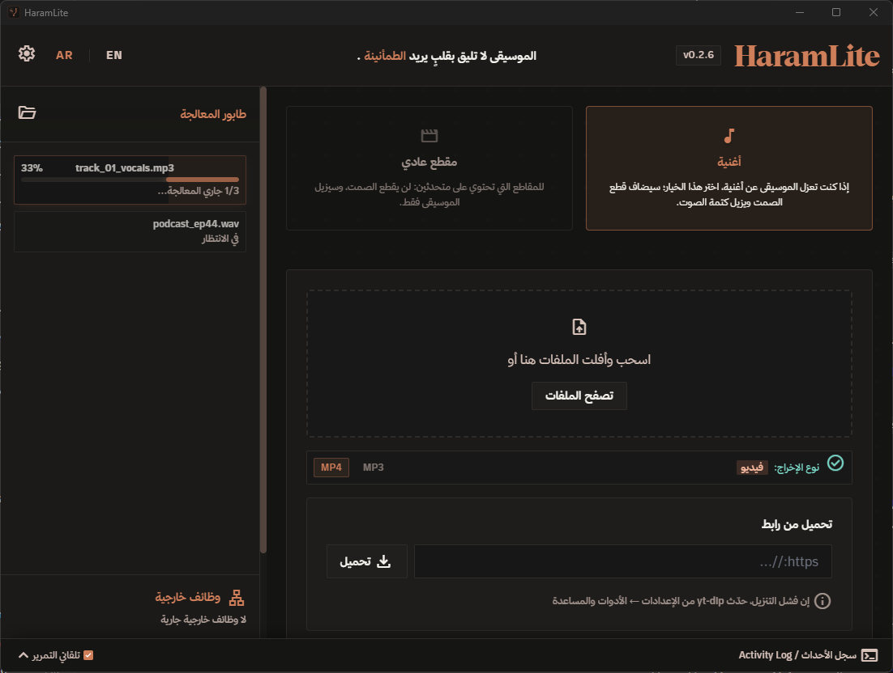

<p align="center">
  <a href="https://haramlite.com/">
    
  </a>
</p>

<h1 align="center">HaramLite</h1>

<p align="center">
  <strong>إزالة الموسيقى من الفيديو والصوت بالذكاء الاصطناعي — محلياً 100% على جهازك</strong><br>
  لا رفع لأي ملف. لا سحابة. لا حسابات.
</p>

<p align="center">
  <em>«الموسيقى لا تليق بقلبٍ يريد الطمأنينة»</em>
</p>

<p align="center">
  <strong>العربية</strong> · <a href="README.en.md">English</a>
</p>

<p align="center">
  <a href="https://haramlite.com/"></a>
  <a href="https://haramlite.com/#download"></a>
  <a href="https://github.com/SMSMy/HaramLite/releases/latest"></a>
  <a href="https://chromewebstore.google.com/detail/kaijaffkolenjhfcbaepmjndheahhikg"></a>
  <a href="LICENSE"></a>
</p>

<p align="center">
  <a href="https://haramlite.com/">الموقع الرسمي</a> ·
  <a href="https://haramlite.com/#download">التحميل</a> ·
  <a href="https://chromewebstore.google.com/detail/kaijaffkolenjhfcbaepmjndheahhikg">إضافة المتصفح</a> ·
  <a href="https://haramlite.com/PRIVACY.html">سياسة الخصوصية</a> ·
  <a href="https://github.com/SMSMy/HaramLite/releases/latest">الإصدارات</a>
</p>

<p align="center">
  
</p>

---

> **هذا المستودع هو الشيفرة المصدرية.**  
> للمستخدمين: كل شيء — التحميل، التثبيت، والإرشادات — على **[haramlite.com](https://haramlite.com/)**.

## ماذا يفعل؟

HaramLite تطبيق ويندوز يفصل الموسيقى عن الكلام **على جهازك** بنموذج ذكاء اصطناعي محلي (ONNX). لا يغادر الملف جهازك في أي خطوة.

| الوضع | النتيجة |
|---|---|
| **مقطع عادي** | يزيل الموسيقى ويبقي الكلام طبيعياً — مناسب للبودكاست والدروس والمقابلات. |
| **أغنية** | يعزل الصوت البشري، يحسّن الحضور، ويتخطّى فترات الصمت تلقائياً. |

**أيضاً:**

- لصق رابط يوتيوب أو غيره — التنزيل والمعالجة في خطوة واحدة
- سحب عدة ملفات دفعة واحدة، أو مجلد مراقبة يعالج كل ما يُضاف إليه
- إضافة متصفح: إرسال الرابط بنقرة، والمشاهدة بعد إزالة الموسيقى داخل الصفحة مع تخطي فترات الصمت
- روبوت تيليجرام اختياري مربوط بحسابك فقط (رمز اقتران من 6 أرقام)
- يعمل في صينية النظام، مع إشعار عند اكتمال المعالجة

التفاصيل والاستخدام: **[haramlite.com](https://haramlite.com/)**

## التحميل

**حمّل من الموقع الرسمي** — هناك المثبت الموصى به ونسخة MSI:

### [haramlite.com/#download](https://haramlite.com/#download)

| الملف | لمن؟ |
|---|---|
| `HaramLite_*_x64-setup.exe` | الجميع — يثبّت VC++ وأدوات المعالجة والنموذج تلقائياً |
| `HaramLite_*_x64_en-US.msi` | البيئات المُدارة (تثبيت صامت / GPO / MDM) |

النسخ الثنائية نفسها منشورة أيضاً في [GitHub Releases](https://github.com/SMSMy/HaramLite/releases/latest).

**التحقّق من سلامة ما نزّلت:** كل إصدار يُرفَق معه ملف [`SHA256SUMS.txt`](https://github.com/SMSMy/HaramLite/releases/latest/download/SHA256SUMS.txt) يحمل بصمة SHA-256 لكل ملف. للتأكد أن ما نزّلته لم يتغيّر بعد التنزيل:

```powershell
# يُطابق البصمة الظاهرة في SHA256SUMS.txt
Get-FileHash .\HaramLite_*_x64-setup.exe -Algorithm SHA256
```

> التوقيع الرقمي غير متوفّر بعد (يحتاج شهادة توقيع كود)، والبصمات هي وسيلة التحقّق المتاحة حالياً.

> التحديث الذاتي داخل التطبيق متوقف حالياً (مفتاح توقيع الإصدارات غير مضبوط بعد). للترقية: نزّل المثبت الجديد من الموقع أو من صفحة الإصدارات.  
> إن نُقص أي مكوّن (نموذج / أدوات) يظهر **معالج إصلاح ذاتي** يعيد تنزيله ويتحقق من بصمة SHA-256.

**المتطلبات:** Windows 10/11 (x64). لا شيء آخر — المثبت يتولى الباقي.  
للسرعة: كرت NVIDIA (CUDA) أو أي كرت DX12 (DirectML) يُستخدم تلقائياً عند تفعيله من الإعدادات.

## الاستخدام السريع

1. ثبّت التطبيق من [صفحة التحميل](https://haramlite.com/#download) وشغّله.
2. أفلت ملفاً (فيديو أو صوت) أو الصق رابطاً.
3. اختر الوضع: **أغنية** أو **مقطع عادي**، والناتج MP3 أو MP4.
4. اضغط المعالجة — النتيجة تُحفظ بجانب الملف الأصلي.

الواجهة عربية/إنجليزية من زر في الأعلى. زر الإغلاق يخفي البرنامج إلى صينية النظام؛ الإغلاق الكامل من قائمة الأيقونة.

## الخصوصية

كل خطوة — الفحص، الفصل، المؤثرات، والترميز — تتم **على جهازك**.

- لا رفع للملفات، لا حسابات، لا تحليلات، لا إعلانات
- الإنترنت اختياري: لتنزيل رابط طلبتَه، أو تحديث yt-dlp، أو روبوت تيليجرام إن فعّلته
- رمز البوت و`api_hash` يُخزَّنان مشفّرين بـ DPAPI داخل `%LOCALAPPDATA%`
- إضافة المتصفح لا ترسل أي طلب شبكة: تتحدث مع التطبيق المحلي عبر Native Messaging فقط

السياسة الكاملة: **[haramlite.com/PRIVACY.html](https://haramlite.com/PRIVACY.html)**

## إضافة المتصفح

إضافة مجانية لمتصفح كروم: إرسال الرابط إلى التطبيق بنقرة، والمشاهدة بعد إزالة الموسيقى **داخل الصفحة** مع تخطي فترات الصمت. الإضافة **لا ترسل أي طلب شبكة**: تتحدّث مع التطبيق على جهازك عبر Native Messaging فقط.

**تتطلّب تطبيق HaramLite لسطح المكتب** (ويندوز 10/11) — بدونه لا تعمل.

**[التثبيت من متجر كروم](https://chromewebstore.google.com/detail/kaijaffkolenjhfcbaepmjndheahhikg)** · صلاحياتها الثلاث (`contextMenus` · `nativeMessaging` · `activeTab`) ونطاق عملها (`youtube.com`) موثّقة في [`docs/STORE.md`](docs/STORE.md).

## للمطورين

البناء من المصدر موثّق في [docs/CONTRIBUTING.md](docs/CONTRIBUTING.md).

**المكدس:** Tauri v2 · Rust · ONNX Runtime (UVR-MDX-NET-Voc_FT) · FFmpeg · yt-dlp · TypeScript / Vite · Tailwind CSS

```text
src/                 الواجهة
src-tauri/src/       خط المعالجة (GUI + CLI)
browser-extension/   إضافة MV3 — جسر محلي بلا تتبع
docs/                دليل المساهمة
```

مشاكل أو اقتراحات: [GitHub Issues](https://github.com/SMSMy/HaramLite/issues/new) — أو من داخل التطبيق: الإعدادات ← **الإبلاغ عن مشكلة**.

## الرخصة

[MIT](LICENSE) © 2026 HaramLite Contributors

إشعارات الطرف الثالث — رخص كل ما يُوزَّع مع البرنامج ومصادره وإسناداته (FFmpeg · نموذج الفصل · yt-dlp · ONNX Runtime · الخطوط · مكتبات Rust): [`THIRD-PARTY-NOTICES.md`](THIRD-PARTY-NOTICES.md).

المشروع مستقل وغير مرتبط بجوجل أو يوتيوب. المستخدم مسؤول عن احترام حقوق المحتوى الذي يعالجه.

---

<p align="center">
  <a href="https://haramlite.com/"><strong>haramlite.com</strong></a>
</p>

---

## English

الوثيقة الإنجليزية صارت **ملفاً مستقلاً**: **[README.en.md](README.en.md)** — الترجمة الكاملة هناك.
