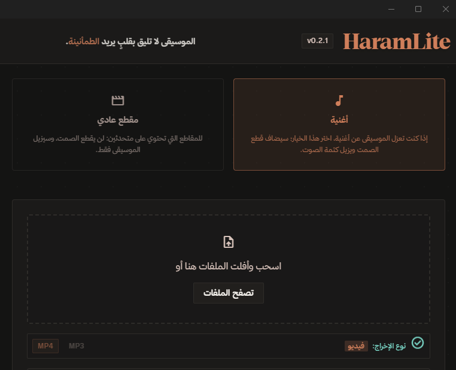

# HaramLite 🎵

**أداة رأي خفيفة لإزالة الموسيقى من المقاطع الصوتية والمرئية بالذكاء الاصطناعي** —
تعمل **محلياً 100%** على جهازك: لا رفع لأي ملف، لا سحابة، لا تسجيل حسابات.

---

## ⬇️ التحميل

| | |
|---|---|
| **أحدث إصدار** |  |
| **المثبت الموصى به** | `HaramLite_*_x64-setup.exe` — يثبّت كل شيء تلقائياً (VC++ Redist + أدوات المعالجة + النموذج) ويدعم **التحديث الذاتي** والإشعارات. |
| نسخة محمولة | تعمل من أي مجلد، لكن **بلا تحديث ذاتي** — استخدم صفحة الإصدارات للترقية يدوياً. |

> 💡 عند حذف أي مكوّن من التطبيق (نموذج/أدوات) يظهر **معالج إصلاح ذاتي** يعيد تنزيله تلقائياً والتحقق من بصمته.

## المتطلبات

- **Windows 10/11** (x64)
- لا شيء آخر — المثبت يتولى الباقي. معالجة أسرع؟ كرت شاشة NVIDIA (CUDA) أو أي كرت DX12 (DirectML) يُستخدم تلقائياً عند تفعيله من الإعدادات.

## ماذا يفعل؟

- **وضع «أغنية»:** فصل الموسيقى + مؤثرات إحياء + قص الصمت تلقائياً — مناسب للمحتوى الهادف.
- **وضع «مقطع عادي»:** إزالة الموسيقى فقط مع إبقاء الكلام طبيعياً.
- **من رابط مباشرة:** الصق رابط YouTube وغيره، والبرنامج ينزّل ويعالج تلقائياً.
- **دفعات:** أفلت عدة ملفات دفعة واحدة — تُعالج بالترتيب مع إمكانية الإيقاف.
- **معاينة سريعة:** جرّب أول 10–30 ثانية قبل معالجة ملف طويل (في وضع الأغنية: عينة جودة الفصل، لا تمثل قصّ الصمت النهائي).
- **مجلد مراقبة:** فعّله من الإعدادات، وأي ملف تضعه في المجلد يُعالج تلقائياً في الخلفية (مع حماية من امتلاء القرص).
- **إضافة المتصفح:** أرسل أي رابط فيديو بنقرة يمين إلى التطبيق — المعالجة كاملة تبقى على جهازك.
- **إشعارات الانتهاء** + صوت خفيف + سجل أحداث حي.

## الاستخدام

1. شغّل HaramLite.
2. أفلت ملفاً (فيديو أو صوت) أو الصق رابطاً.
3. اختر الوضع («أغنية» أو «مقطع عادي») والناتج (MP3 / MP4).
4. اضغط زر المعالجة — والنتيجة بجانب الملف الأصلي.

الواجهة ثنائية اللغة (عربية/إنجليزية) بزر التبديل في الأعلى.

## الخصوصية

كل خطوة — الفحص، الفصل بالذكاء الاصطناعي، المؤثرات، والترميز — تتم **على جهازك**.
التطبيق لا يرسل ملفاتك لأي مكان، والاتصال الوحيد بالإنترنت اختياري (تنزيل الروابط،
تحديث yt-dlp، والتحديث الذاتي).

## مشاكل أو اقتراحات؟

— أو من داخل التطبيق: الإعدادات ← **الإبلاغ عن مشكلة**.

---

## للمطورين

التطوير والبناء من المصدر موثق في [CONTRIBUTING.md](CONTRIBUTING.md).

**التقنيات:** Tauri v2 · Rust · ONNX Runtime (UVR-MDX-NET-Voc_FT) · FFmpeg · yt-dlp · TypeScript/Vite · Tailwind CSS · خط ثمانية (Thmanyah)

**الرخصة:** [LICENSE](LICENSE)
