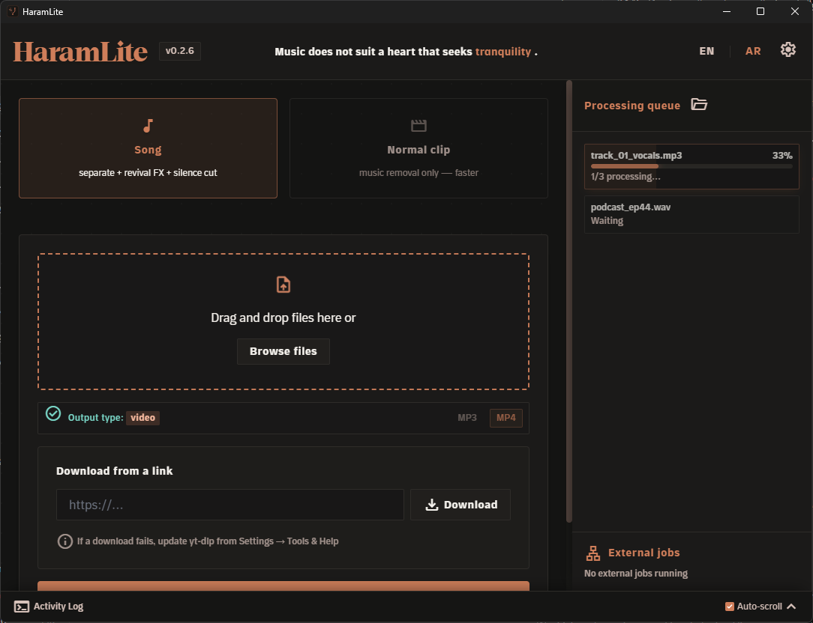

<p align="center">
  <a href="https://haramlite.com/">
    
  </a>
</p>

<h1 align="center">HaramLite</h1>

<p align="center">
  <strong>Remove music from video and audio with on-device AI — 100% local</strong><br>
  No file uploads. No cloud. No accounts.
</p>

<p align="center">
  <strong>English</strong> · <a href="README.ar.md">العربية</a>
</p>

<p align="center">
  <a href="https://haramlite.com/"></a>
  <a href="https://haramlite.com/#download"></a>
  <a href="https://github.com/SMSMy/HaramLite/releases/latest"></a>
  <a href="https://chromewebstore.google.com/detail/kaijaffkolenjhfcbaepmjndheahhikg"></a>
  <a href="LICENSE"></a>
</p>

<p align="center">
  <a href="https://haramlite.com/">Website</a> ·
  <a href="https://haramlite.com/#download">Download</a> ·
  <a href="https://chromewebstore.google.com/detail/kaijaffkolenjhfcbaepmjndheahhikg">Browser extension</a> ·
  <a href="https://haramlite.com/PRIVACY.html">Privacy policy</a> ·
  <a href="https://github.com/SMSMy/HaramLite/releases/latest">Releases</a>
</p>

<p align="center">
  
</p>

---

> **This repository is the source code.**
> If you are a user: everything — download, install and guides — is at **[haramlite.com](https://haramlite.com/)**.

## What it does

HaramLite is a Windows app that separates music from speech **on your own machine** with a local AI model (ONNX). Your file does not leave the device at any step.

| Mode | Result |
|---|---|
| **Normal clip** | Removes the music and keeps speech natural — for podcasts, lectures and interviews. |
| **Song** | Isolates the vocal, improves presence, and skips silent stretches automatically. |

**Also:**

- Paste a YouTube (or other) link — download and processing in one step
- Drop in several files at once, or use a watch folder that processes whatever is added to it
- Browser extension: send a link with one click, then watch it in the page with the music removed and silent gaps skipped
- Optional Telegram bot paired to your account only (6-digit pairing code)
- Runs in the system tray and notifies you when processing finishes

Details and usage: **[haramlite.com](https://haramlite.com/)**

## Download

**Download from the official site** — the recommended installer and an MSI build are there:

### [haramlite.com/#download](https://haramlite.com/#download)

| File | Who it is for |
|---|---|
| `HaramLite_*_x64-setup.exe` | Everyone — installs the VC++ runtime, the media tools and the model |
| `HaramLite_*_x64_en-US.msi` | Managed environments (silent install / GPO / MDM) |

The same binaries are also published on [GitHub Releases](https://github.com/SMSMy/HaramLite/releases/latest).

**Verify what you downloaded:** every release carries a [`SHA256SUMS.txt`](https://github.com/SMSMy/HaramLite/releases/latest/download/SHA256SUMS.txt) with a SHA-256 digest for each file. To confirm the file was not altered after download:

```powershell
# must match the digest printed in SHA256SUMS.txt
Get-FileHash .\HaramLite_*_x64-setup.exe -Algorithm SHA256
```

> Code signing is not available yet (it needs a code-signing certificate), so the published digests are the verification method available today.

> In-app self-update is currently disabled (the release signing key is not set up yet). To upgrade, download the new installer from the site or the releases page.  
> If a component (model / tools) is missing, a **self-repair wizard** re-downloads it and checks its SHA-256.

**Requirements:** Windows 10/11 (x64). Nothing else — the installer handles the rest.  
For speed: an NVIDIA GPU (CUDA) or any DX12 GPU (DirectML), used automatically once enabled in Settings.

## Quick start

1. Install the app from the [download page](https://haramlite.com/#download) and launch it.
2. Drop a file (video or audio) or paste a link.
3. Choose a mode — **Song** or **Normal clip** — and an output: MP3 or MP4.
4. Press process. The result is saved next to the original file.

The interface switches between Arabic and English from a button at the top. The close button hides the app to the system tray; quit fully from the tray icon menu.

## Privacy

Every step — probing, separation, effects and encoding — runs **on your machine**.

- No file uploads, no accounts, no analytics, no ads
- The network is optional: to download a link you asked for, to update yt-dlp, or for the Telegram bot if you enable it
- The bot token and `api_hash` are stored encrypted with DPAPI under `%LOCALAPPDATA%`
- The browser extension sends no network request: it talks to the local app over Native Messaging only

Full policy: **[haramlite.com/PRIVACY.html](https://haramlite.com/PRIVACY.html)**

## Browser extension

A free Chrome extension: send the current link to the app with one click, then watch it **in the page** with the music removed and silent gaps skipped. The extension **sends no network request**: it talks to the app on your machine over Native Messaging only.

**It requires the HaramLite desktop app** (Windows 10/11) — it does not work without it.

**[Install from the Chrome Web Store](https://chromewebstore.google.com/detail/kaijaffkolenjhfcbaepmjndheahhikg)** · Its three permissions (`contextMenus` · `nativeMessaging` · `activeTab`) and its single host scope (`youtube.com`) are documented in [`docs/STORE.md`](docs/STORE.md) *(in Arabic)*.

## For developers

Building from source is documented in [docs/CONTRIBUTING.md](docs/CONTRIBUTING.md) *(in Arabic)*.

**Stack:** Tauri v2 · Rust · ONNX Runtime (UVR-MDX-NET-Voc_FT) · FFmpeg · yt-dlp · TypeScript / Vite · Tailwind CSS

```text
src/                 frontend
src-tauri/src/       processing pipeline (GUI + CLI)
browser-extension/   MV3 extension — a local bridge with no tracking
docs/                contributing guide
```

Bugs or suggestions: [GitHub Issues](https://github.com/SMSMy/HaramLite/issues/new) — or from inside the app: Settings → **Report a problem**.

## License

[MIT](LICENSE) © 2026 HaramLite Contributors

Third-party notices — the licence, source and attribution of everything distributed with the app (FFmpeg · separation model · yt-dlp · ONNX Runtime · fonts · Rust crates): [`THIRD-PARTY-NOTICES.md`](THIRD-PARTY-NOTICES.md).

This project is independent and not affiliated with Google or YouTube. You are responsible for respecting the rights of the content you process.

---

<p align="center">
  <a href="https://haramlite.com/"><strong>haramlite.com</strong></a>
</p>
