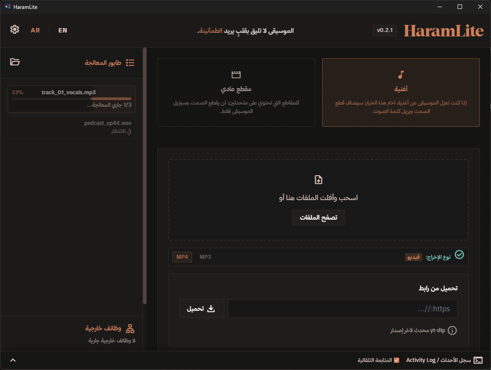

# HaramLite 🎵

**أداة رأي خفيفة لإزالة الموسيقى من المقاطع الصوتية والمرئية بالذكاء الاصطناعي** —
تعمل **محلياً 100%** على جهازك: لا رفع لأي ملف، لا سحابة، لا تسجيل حسابات.

🌐 **الموقع الرسمي:** <https://haramlite.com>

---

## ⬇️ التحميل

| | |
|---|---|
| **أحدث إصدار** |  |
| **المثبت الموصى به** | `HaramLite_*_x64-setup.exe` — يثبّت كل شيء تلقائياً (VC++ Redist + أدوات المعالجة + النموذج) مع إشعارات الانتهاء. |
| نسخة MSI | `HaramLite_*_x64_en-US.msi` — للبيئات التي تُدار بالنطاق أو التثبيت الصامت. |
| نسخة محمولة | **لم تتوفر في 0.2.2** — تحتاج مجلدَي `bin` و`models` بجانب التنفيذي (~515MB)، والمثبّت هو الطريق المدعوم حالياً. |

> ℹ️ **التحديث الذاتي موقوف حالياً** (مفتاح توقيع الإصدارات غير مضبوط في المستودع بعد)، فالترقية تكون بتنزيل المثبت الجديد من [صفحة الإصدارات](https://github.com/SMSMy/HaramLite/releases/latest). وسيعود بزر واحد بعد ضبط المفتاح.

> 💡 عند حذف أي مكوّن من التطبيق (نموذج/أدوات) يظهر **معالج إصلاح ذاتي** يعيد تنزيله تلقائياً والتحقق من بصمته.

## الجديد في 0.2.2

- **التشغيل مع بدء تشغيل ويندوز:** خيار يسألك عنه البرنامج مرة واحدة بعد التثبيت، ويقلع **في الخلفية بلا فتح نافذة** ليبقى بوت تيليجرام وتكامل المتصفح جاهزين بعد كل إقلاع. تجده دائماً في **الإعدادات ← «التشغيل مع بدء تشغيل ويندوز»**، وتفتح النافذة من أيقونة الشريط. لا يطلب صلاحيات مسؤول، ومسار قديم بعد نقل البرنامج لا يُعدّ مفعّلاً.
- **كشف وجود إضافة المتصفح:** لا يستطيع برنامج مكتبي أن يعدّ إضافات متصفحك، لكن مضيف الاتصال يسجّل أصل كل إضافة تتصل به. فإن لم يتصل متصفح قط، يعرض البرنامج في الإعدادات **رابط صفحة الإضافة** ليوجّهك إلى التثبيت.
- **اختيار الوضع لكل طلب من نافذة الإضافة:** «مقطع عادي» أو «وضع أغنية» لهذا الرابط تحديداً، بدل إعداد عام. ومتوافق للخلف: الطلب بلا وضع يسلك السلوك السابق.
- **إصلاحات الواجهة:** قائمة الإعدادات صارت قابلة للتمرير (لا تختفي بنودها على الشاشات الصغيرة)، و«حول البرنامج» صار آخر عنصر فيها.
## الجديد في 0.2.1

- **بوت تيليجرام (اختياري):** أرسل رابطاً أو ارفع ملف صوت/فيديو، والبوت يسألك «أغنية أم مقطع عادي؟» ثم يعالج **على جهازك** ويعيد الناتج إليك.
  - **اقتران بالرمز:** لا يعمل البوت لأي أحد حتى تربط حسابك — تعرض الإعدادات رمزاً من ٦ أرقام صالحاً ١٠ دقائق (٥ محاولات ثم يُبطَل)، ترسله للبوت فيُسجَّل معرّفك تلقائياً. أي شخص آخر يُتجاهل تماماً.
  - **حدود تيليجرام معلنة:** البوت يرسل حتى **50MB** ولا يستطيع تنزيل أكثر من **20MB** من ملف أرسلته له (الروابط بلا حد). لذلك يُعاد ترميز الفيديو الكبير تلقائياً ليدخل في الحد، وإن كان الضغط سيشوّه الصورة يُرسَل الصوت بجودة كاملة مع إعلان السبب. ومن يشغّل **خادم Bot API محلي** (إعداد متقدم) يرفع السقف إلى **2GB** وبالجودة الأصلية.
  - خيار «إرسال الصوت فقط (MP3) دائماً» لتوفير وقت رندرة الفيديو.
- **أيقونة الشريط:** البرنامج يعمل في الخلفية (بوت/مراقبة/تكامل المتصفح) وزر الإغلاق **يُخفي إلى الشريط** بدل إنهاء العملية — والإغلاق الكامل من قائمة الأيقونة، والنقر عليها يُعيد النافذة.
- **مشاهدة مفلترة في المتصفح:** صارت **تتخطّى مقاطع الصمت** الناتجة عن كتم الموسيقى (قفز الفيديو فوقها فوراً) بدل تشغيلها، مع خيار في قائمة الزر الأيمن يوقف التخطي.
- **أمان الإعدادات:** توكن البوت و`api_hash` **مشفّران بـ DPAPI** داخل `settings.json` (لا نصّ صريح على القرص)، ومجلد بيانات البرنامج انتقل إلى `%LOCALAPPDATA%` فلا يسافر مع ملف التعريف المتجول ولا مع النسخ السحابي.
- **إصلاحات:** تنظيف مجلدات العمل المؤقتة تلقائياً، وإزالة ضجيج السجل المكرر، وتلميع سلوك الإلغاء في مسارات المعالجة.

## المتطلبات

- **Windows 10/11** (x64)
- لا شيء آخر — المثبت يتولى الباقي. معالجة أسرع؟ كرت شاشة NVIDIA (CUDA) أو أي كرت DX12 (DirectML) يُستخدم تلقائياً عند تفعيله من الإعدادات.

## ماذا يفعل؟

- **وضع «أغنية»:** فصل الموسيقى + تحسين الصوت (حضور وصدى) + قص الصمت تلقائياً — مناسب للمحتوى الهادف.
- **وضع «مقطع عادي»:** إزالة الموسيقى فقط مع إبقاء الكلام طبيعياً.
- **من رابط مباشرة:** الصق رابط YouTube وغيره، والبرنامج ينزّل ويعالج تلقائياً.
- **دفعات:** أفلت عدة ملفات دفعة واحدة — تُعالج بالترتيب مع إمكانية الإيقاف أثناء المعالجة.
- **مجلد مراقبة:** فعّله من الإعدادات، وأي ملف تضعه في المجلد يُعالج تلقائياً في الخلفية (مع حماية من امتلاء القرص).
- **إضافة المتصفح:** أرسل أي رابط فيديو بنقرة يمين إلى التطبيق — المعالجة كاملة تبقى على جهازك. ويمكن **مشاهدة الفيديو مفلتراً** داخل الصفحة (الصوت من المعالجة المحلية مع تخطي مقاطع الصمت).
- **بوت تيليجرام (اختياري):** نفس الخط كاملاً من هاتفك — رابط أو ملف، وسؤال «أغنية أم مقطع عادي؟»، ثم الناتج يعود إليك (انظر «الجديد في 0.2.1» للحدود والاقتران).
- **أيقونة الشريط:** يعمل في الخلفية مع وصول دائم إليه وإغلاق نظيف من الأيقونة.
- **إشعارات الانتهاء** + صوت خفيف + سجل أحداث حي.

## الاستخدام

1. شغّل HaramLite.
2. أفلت ملفاً (فيديو أو صوت) أو الصق رابطاً.
3. اختر الوضع («أغنية» أو «مقطع عادي») والناتج (MP3 / MP4).
4. اضغط زر المعالجة — والنتيجة بجانب الملف الأصلي.

الواجهة ثنائية اللغة (عربية/إنجليزية) بزر التبديل في الأعلى.

## الخصوصية

كل خطوة — الفحص، الفصل بالذكاء الاصطناعي، المؤثرات، والترميز — تتم **على جهازك**.
التطبيق لا يرسل ملفاتك لأي مكان، والاتصال الوحيد بالإنترنت اختياري (تنزيل الروابط،
تحديث yt-dlp، والتحديث الذاتي، وبوت تيليجرام إن فعّلته).

- **تيليجرام اختياري تماماً** ولا يعمل إلا بتوكن تضعه أنت، ولا يستجيب لأي حساب حتى تربط حسابك برمز الاقتران.
- **الأسرار على القرص مشفّرة:** توكن البوت و`api_hash` يُخزَّنان مشفّرين بـ DPAPI (مرتبطين بحسابك وجهازك)، ولا يُحفظ أي منهما في متصفح الواجهة. ونسخة الإعدادات المنسوخة إلى جهاز آخر لا تحمل سراً قابلاً للاستخدام.
- **مجلد البيانات** في `%LOCALAPPDATA%` (لا يسافر مع الملف الشخصي المتجول ولا يدخل النسخ السحابي).

## مشاكل أو اقتراحات؟

— أو من داخل التطبيق: الإعدادات ← **الإبلاغ عن مشكلة**.

---

## للمطورين

التطوير والبناء من المصدر موثق في [CONTRIBUTING.md](docs/CONTRIBUTING.md).

**التقنيات:** Tauri v2 · Rust · ONNX Runtime (UVR-MDX-NET-Voc_FT) · FFmpeg · yt-dlp · TypeScript/Vite · Tailwind CSS · خط ثمانية (Thmanyah)

**الرخصة:** [LICENSE](LICENSE)
